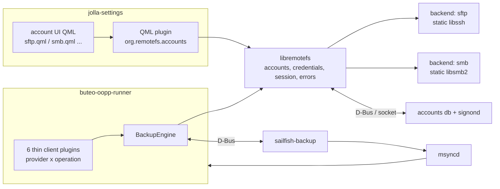

# SFTP and SMB backup accounts for Sailfish OS — core specification

| | |
|---|---|
| Status | Draft 0.1, 2026-10-01 |
| Target | Sailfish OS 5.2.0 and later, aarch64 only |
| Distribution | Not Harbour (uses privileged account and sync APIs). Chum, OpenRepos or a private OBS repo |
| Companion documents | [SPEC-sftp.md](SPEC-sftp.md), [SPEC-smb.md](SPEC-smb.md) |
| Working name | `remotefs` (packages, library and QML module names below are placeholders) |

Requirement keywords MUST, SHOULD and MAY are used as in RFC 2119.

Every platform fact in this document carries one of three evidence tags:

- **[src]** read in open source at the commit current on 2026-10-01
- **[rpm]** read in the 5.2.0.18 aarch64 release repository (package metadata, or plain-text QML and config shipped in closed packages)
- **[test]** exercised in a sandbox on 2026-10-01 (section 12.1)

Anything not tagged is a design decision of this spec. Things that could not be checked without a device are collected in section 12.3.

---

## 1. Goals and scope

**G1 (primary).** A user adds an "SFTP" or "SMB" account in *Settings → Accounts*. The account then appears as a storage target in the stock *Settings → Backup* page, and manual backup, scheduled backup, listing and restore work exactly as they do for a Nextcloud account.

**G2 (secondary).** The protocol and credential code is a reusable library, so that a future file browser can open the same accounts without re-implementing anything. Only the shape of the library is in scope here; the file browser is not.

### Non-goals

- Share-sheet integration and Gallery integration.
- Folder synchronisation, automatic photo upload, mounting (FUSE or kernel CIFS).
- Sailfish OS older than 5.2, any architecture other than aarch64, Harbour compliance.
- SFTP: SSH agent, certificates, FIDO/security-key authentication, jump hosts, reading `~/.ssh`.
- SMB: SMB1, SMB 2.x, guest or anonymous access, Kerberos, share or server discovery, DFS.
- Encrypting the backup archive itself (see section 13, L5).

---

## 2. Platform baseline

Versions in the 5.2.0.18 aarch64 release repository **[rpm]**:

| Component | Version | Relevance |
|---|---|---|
| Qt | 5.6.3 | UI and plugin toolkit |
| gcc / glibc | 13.4.0 / 2.41 | toolchain |
| cmake / meson | 3.31.8 / 1.9.1 | available for building vendored libraries |
| OpenSSL | 3.5.7 | crypto backend for libssh |
| OpenSSH | 10.3p1 | reference peer version |
| GnuTLS | 2.12.24 | too old for Samba's client libraries |
| libaccounts-qt5 / signon-qt5 | 1.17 / 8.61.0 | Accounts&SSO |
| sailfish-components-accounts-qt5 | 0.4.9 | `Sailfish.Accounts` QML and `libsailfishaccounts` |
| jolla-settings-accounts | 0.6.15 (closed) | account UI host and agent base types |
| buteo-syncfw-qt5 | 0.11.11 | sync daemon `msyncd`, out-of-process plugins |
| jolla-vault | 1.1.46 (closed) | `sailfish-backup` service and Backup settings page |
| sailfish-account-nextcloud | 1.1.3 | reference implementation of a backup account |

Not present in the release repository **[rpm]**: libssh, libssh2, libsmbclient, libsmb2, krb5. Both protocol libraries therefore have to be vendored.

The Accounts&SSO framework is documented as slated for replacement, with no roadmap **[src: docs.sailfishos.org, Accounts_and_SSO]**. Jolla added a new provider on it in 5.2 (Mastodon), so it is the supported integration path for the lifetime of this spec.

---

## 3. The platform contract for a backup account

This section records how the platform discovers and drives a backup account. Everything in sections 6 to 8 follows from it.

### 3.1 Provider, service and UI files

- A provider is `/usr/share/accounts/providers/<provider>.provider`; a service is `/usr/share/accounts/services/<service>.service` **[src: docs, nextcloud]**.
- A provider tag `user-group:<group>` hides the provider from users outside that group. A provider without such a tag is allowed for everyone **[src: sailfish-components-accounts `providerhelper.cpp`]**.
- The Settings app loads the creation UI from `/usr/share/accounts/ui/<provider>.qml` **[rpm: `AccountCreationManager.qml`]**, the settings UI from `<provider>-settings.qml` and the credentials-update UI from `<provider>-update.qml` **[src: docs, nextcloud, mastodon]**.
- Root types come from the closed module `com.jolla.settings.accounts 1.0`: `AccountCreationAgent`, `AccountSettingsAgent`, `AccountCredentialsAgent` **[rpm]**. Their interface as shipped in 5.2.0.18 is listed in section 7.1.

### 3.2 Discovery by the Backup page

- The Backup page lists every **enabled** account that has an **enabled** service of type `storage`. There is no provider allow-list **[rpm: jolla-vault `BackupRestoreStorageListModel.qml` uses `AccountModel` with `ServiceTypeFilter`, filter `storage`, `filterByEnabled`]**.
- The row label is `<provider display name> (<accountUserName>)`, where `accountUserName` is the account's global key `default_credentials_username` **[rpm, src: `accountmodel.cpp`]**.
- An account whose `CredentialsNeedUpdate` key is true is shown as "not signed in" and is not queried **[rpm]**.
- Cloud targets are only queried while the connection manager reports the global state *online* **[rpm]**. See limitation L1.

### 3.3 Naming contract

The backup service and its sync profiles are located purely by name **[src: `accountsyncmanager.cpp`]**:

| Item | Required name |
|---|---|
| Service | `<provider>-backup` |
| Sync profile templates | `<provider>.Backup`, `<provider>.BackupQuery`, `<provider>.BackupRestore` |
| Per-account profiles (created by the platform) | `<provider>.Backup-<accountId>` and so on |
| Buteo client profile → plugin file | client profile `<name>` loads `/usr/lib64/buteo-plugins-qt5/oopp/lib<name>-client.so` **[src: buteo `PluginManager.cpp`]** |

The per-account profiles are created by the Backup page, not by the account UI **[src: docs, Backup_Accounts]**.

### 3.4 Backup service D-Bus interface

Session bus, service `org.sailfishos.backup`, path `/sailfishbackup`, interface `org.sailfishos.backup` **[src: docs, nextcloud `syncer.cpp`, dropbox and onedrive adaptors]**:

| Member | Signature | Use |
|---|---|---|
| `backupFileDeviceId()` | → `s` | name of the per-device remote subdirectory |
| `createBackupForSyncProfile(profileName)` | `s` → `s` | starts archive creation, returns the local file path |
| `setCloudBackups(profileName, files)` | `s`, `as` | reports the remote listing |
| signal `cloudBackupStatusChanged` | `i accountId`, `s status` | `UploadingBackup`, `Canceled` or `Error` |
| signal `cloudBackupError` | `i`, `s`, `s` | failure during archive creation |
| signal `cloudRestoreStatusChanged` | `i`, `s` | `Canceled` or `Error` |
| signal `cloudRestoreError` | `i`, `s`, `s` | failure during restore |

For restore, the local target path including the file name is in the sync profile key `sfos-backuprestore-file` **[src]**.

### 3.5 Credentials

- Secrets live in signond. A password-method identity returns `UserName` and `Secret` **[src: `accountauthenticator.cpp`]**.
- `libsailfishaccounts` creates such an identity with `Account::createSignInCredentials()`; without a symmetric key it also becomes the default `CredentialsId` for the account and all its services **[src: `account.cpp`]**.
- `Account::remove()` deletes only identities referenced by keys containing `segregated_credentials` (which `createSignInCredentials()` writes) **[src]**. An identity referenced only by `CredentialsId` would be orphaned.
- The stock helper `AccountAuthenticator` rejects accounts without a `server_address` key or with an empty password **[src]**. It is unsuitable here and is not used.
- A device restore re-creates accounts without their secrets and sets `CredentialsNeedUpdate` (default build configuration) **[src: `accountbackuprestorer.cpp`]**.

### 3.6 Process model

| Process | Loads | Sandbox |
|---|---|---|
| `jolla-settings` | account UI QML and its C++ QML plugin | none (`Sandboxing=Disabled`) **[rpm]** |
| `buteo-oopp-runner`, started by `msyncd` | one Buteo client plugin per run | none; `msyncd` holds the accounts privilege **[rpm, src]** |
| `sailfish-backup` | nothing of ours | n/a |
| future file browser | `libremotefs` | Sailjail; needs the `Accounts` and `Internet` permissions, which give access to signond but not to `~/.ssh` **[rpm: sailjail permission files]** |

The last row is why private keys are stored in signond and never referenced by path.

---

## 4. Architecture



### 4.1 Packages and installed files

| Package | Contents |
|---|---|
| `remotefs-core` | `/usr/lib64/libremotefs.so.0*`; QML module `org.remotefs.accounts` under `/usr/lib64/qt5/qml/org/remotefs/accounts/` (C++ plugin plus shared pages); translations |
| `remotefs-core-devel` | headers and `remotefs.pc` (for the future file browser) |
| `remotefs-account-sftp` | backend `/usr/lib64/remotefs/backends/libremotefs-sftp.so`; provider, service and three UI files; three Buteo plugins and six profile XML files; icon |
| `remotefs-account-smb` | the same set for `smb` |

Each backend is a separately packaged plugin that statically contains its protocol library. Removing the SMB package removes all libsmb2 code from the device, and no process that only handles SFTP ever maps it.

Per provider `<p>` (`sftp` or `smb`) the account package installs:

```
/usr/share/accounts/providers/<p>.provider
/usr/share/accounts/services/<p>-backup.service
/usr/share/accounts/ui/<p>.qml
/usr/share/accounts/ui/<p>-settings.qml
/usr/share/accounts/ui/<p>-update.qml
/usr/lib64/buteo-plugins-qt5/oopp/lib<p>-backup-client.so
/usr/lib64/buteo-plugins-qt5/oopp/lib<p>-backupquery-client.so
/usr/lib64/buteo-plugins-qt5/oopp/lib<p>-backuprestore-client.so
/etc/buteo/profiles/client/<p>-backup.xml
/etc/buteo/profiles/client/<p>-backupquery.xml
/etc/buteo/profiles/client/<p>-backuprestore.xml
/etc/buteo/profiles/sync/<p>.Backup.xml
/etc/buteo/profiles/sync/<p>.BackupQuery.xml
/etc/buteo/profiles/sync/<p>.BackupRestore.xml
/usr/share/themes/sailfish-default/silica/z*/icons/graphic-service-<p>.png
```

---

## 5. Core library `libremotefs`

### 5.1 Responsibilities

- **C-1** Load an account's connection parameters from the accounts database by account id.
- **C-2** Fetch the account's secret from signond without user interaction (`UiPolicy = NoUserInteractionPolicy`).
- **C-3** Locate and load the backend for the account's provider (`QPluginLoader` over `/usr/lib64/remotefs/backends/`).
- **C-4** Provide one blocking, cancellable file API over all backends.
- **C-5** Provide a single error taxonomy (5.4) and never expose library-specific codes above the backend.
- **C-6** Record attention states on the account (6.4).

The library depends on QtCore, QtDBus, libaccounts-qt5 and libsignon-qt5 only. It MUST NOT depend on QtGui, QtQuick or Buteo, so that a sandboxed application can link it.

### 5.2 API shape

The API is unstable (SONAME 0) until a second consumer exists. The shape below is normative; exact signatures are not.

```cpp
namespace RemoteFs {

struct Entry { QString name; qint64 size; QDateTime modified; bool isDir; };

struct ServerIdentity {            // empty for protocols without one (SMB)
    QString algorithm;             // e.g. "ssh-ed25519"
    QByteArray publicKey;          // raw blob
    QString fingerprint;           // "SHA256:..." as printed by ssh-keygen -lf
};

class Backend {                    // one instance = one connection; thread-confined
public:
    virtual Result connect(const ConnectionParams &, ServerIdentity *seen) = 0;  // no credentials sent
    virtual Result authenticate(const Credentials &) = 0;
    virtual Result stat(const QString &path, Entry *out) = 0;
    virtual Result list(const QString &dir, QVector<Entry> *out) = 0;
    virtual Result makePath(const QString &dir) = 0;                              // mkdir -p
    virtual Result remove(const QString &path) = 0;
    virtual Result rename(const QString &from, const QString &to) = 0;            // replaces `to`
    virtual Result freeSpace(const QString &dir, qint64 *bytes) = 0;              // Unsupported allowed
    virtual Result upload(QIODevice *source, const QString &path, Progress *) = 0;   // streamed
    virtual Result download(const QString &path, QIODevice *sink, Progress *) = 0;   // streamed
    virtual Result read(const QString &path, qint64 offset, qint64 len, QByteArray *out) = 0; // G2
    virtual void cancel() = 0;                                                    // thread-safe
    virtual void disconnect() = 0;
};

class AccountSession {             // convenience: params + credentials + backend + policy
public:
    static AccountSession *open(int accountId, QObject *parent);   // async, emits ready()/failed(Error)
    Backend *backend();
    QString backupsPath() const;                                   // from the <p>-backup service
};

}
```

- **C-7** `connect()` and `authenticate()` are separate steps so the caller can verify server identity before any credential leaves the device.
- **C-8** All `Backend` calls block. Callers MUST run them on a worker thread and MUST keep the owning thread's event loop running (the Buteo plugin needs it for D-Bus).
- **C-9** `cancel()` MUST be callable from any thread and MUST make the in-flight call return `Canceled` within 2 seconds on a healthy connection.
- **C-10** `upload()` and `download()` MUST stream in bounded memory (no whole-file buffering; the Nextcloud reference reads the whole archive into RAM, which this spec does not copy).
- **C-11** `read()` with an offset exists for G2 and MAY be left unimplemented (`Unsupported`) in the first release.

### 5.3 Transfer rules (all backends)

- **C-12** Upload to `<final>.part`, flush to stable storage where the protocol allows, compare remote size with bytes sent, then rename to `<final>`. On any failure, best-effort remove the `.part` file.
- **C-13** Before uploading, call `freeSpace()`; if it returns a value smaller than the file size, fail with `NoSpace` without transferring.
- **C-14** Timeouts: connect 15 s, any single request 60 s. No automatic retry inside the library.
- **C-15** Paths use `/` as separator at the API. Backends translate. Path components `.` and `..` are rejected.

### 5.4 Errors

`None, Canceled, NetworkUnreachable, Timeout, ServerIdentityUnknown, ServerIdentityChanged, AuthFailed, SecurityPolicy, PermissionDenied, NotFound, AlreadyExists, NoSpace, Unsupported, ProtocolError, Internal`

`SecurityPolicy` means the server could not meet a mandatory security requirement (for example no SMB3, or no common SSH algorithm).

### 5.5 Logging

- **C-16** `QLoggingCategory` names `remotefs.core`, `remotefs.sftp`, `remotefs.smb`, `remotefs.buteo`, `remotefs.ui`. Default level warning.
- **C-17** Secrets, private keys, and SMB challenge or response material MUST never be logged at any level. Host names, user names and remote paths MAY be logged at debug level only.

---

## 6. Account data model

### 6.1 Provider and service files

`<p>.provider` (no `user-group` tag, so no `manage-groups` scriptlet is needed):

```xml
<?xml version="1.0" encoding="UTF-8"?>
<!DOCTYPE provider>
<provider version="1.0" id="sftp">
    <name>SFTP</name>
    <description>Backups to an SSH/SFTP server</description>
    <icon>image://theme/graphic-service-sftp</icon>
</provider>
```

`<p>-backup.service`:

```xml
<?xml version="1.0" encoding="UTF-8"?>
<service id="sftp-backup">
    <type>storage</type>
    <name>Backups</name>
    <icon>image://theme/icon-m-storage</icon>
    <provider>sftp</provider>
    <template>
        <setting name="sync_profile_templates" type="as">["sftp.Backup", "sftp.BackupQuery", "sftp.BackupRestore"]</setting>
        <group name="auth">
            <setting name="method">password</setting>
            <setting name="mechanism">password</setting>
        </group>
    </template>
</service>
```

Provider ids `sftp` and `smb` are deliberately plain. If Jolla ever ships providers with the same ids the packages will conflict at file level, which is the desired outcome (no silent shadowing).

Service ids `<p>-files` are reserved for G2 and MUST NOT be shipped now.

### 6.2 Settings keys

Connection settings are account-global so that a future second service can share them. Only `backups_path` is service-scoped, because the platform defines it that way.

| Key | Scope | Type | Meaning |
|---|---|---|---|
| `remotefs/host` | global | string | DNS name or IP literal |
| `remotefs/port` | global | int | 0 means protocol default |
| `remotefs/username` | global | string | login name (also stored in the identity) |
| `remotefs/attention` | global | string | empty, `auth-failed` or `server-identity-changed` (6.4) |
| `remotefs/sftp/*`, `remotefs/smb/*` | global | | provider-specific, see companion specs |
| `backups_path` | service `<p>-backup` | string | remote directory for backups; default `Sailfish OS/Backups` |
| `default_credentials_username` | global | string | display label `user@host` (platform key, shown by the Backup page) |
| `CredentialsNeedUpdate`, `CredentialsNeedUpdateFrom` | global | bool, string | platform keys |

- **A-1** The account display name defaults to `user@host` and is user-editable.
- **A-2** `default_credentials_username` is set to `user@host` after credential creation, so that two accounts with the same login on different servers are distinguishable in the Backup page. The Mastodon plugin uses the key as a display label in the same way **[src]**.

### 6.3 Credentials

- **A-3** Exactly one signond identity per account, method `password`, mechanism `password`, created through `libsailfishaccounts` `Account::createSignInCredentials(applicationName = "remotefs", credentialsName = "default", …)` with no symmetric key. This sets `CredentialsId` and writes the `segregated_credentials` reference that makes account deletion remove the identity (3.5).
- **A-4** `UserName` is the login name. `Secret` is defined per provider in the companion specs and is always a single-line ASCII or UTF-8 string.
- **A-5** No secret is ever written to the accounts database, a profile, a file or a log.
- **A-6** Runtime reads use `SignOn::Identity::existingIdentity(credentialsId)` and a `password` session with `NoUserInteractionPolicy`. A missing identity or an empty secret is reported as `AuthFailed`.

### 6.4 Attention states

When a run fails with `AuthFailed` or `ServerIdentityChanged`, the core:

1. sets `remotefs/attention` to `auth-failed` or `server-identity-changed`;
2. sets `CredentialsNeedUpdate = true` and `CredentialsNeedUpdateFrom = <p>-backup`.

The platform then shows the account as not signed in and the Backup page stops using it. The user resolves the state through `<p>-update.qml`, reached from the account's settings page, which clears all three keys. This reuses the only user-visible "needs attention" channel the platform offers.

---

## 7. Settings UI

### 7.1 Platform types used

Interface as shipped in `jolla-settings-accounts` 0.6.15 **[rpm]**. These types are closed; see risk R1.

| Type | Members relied on |
|---|---|
| `AccountCreationAgent` | `initialPage`, `delayDeletion`, `accountManager`, `accountProvider`, `endDestination`, `endDestinationAction`, `endDestinationProperties`, `endDestinationReplaceTarget`, signals `accountCreated(int)`, `accountCreationError(string)`, `goToEndDestination()` |
| `AccountSettingsAgent` | `accountId`, `accountProvider`, `accountManager`, `accountsHeaderText`, `delayDeletion`, `accountIsReadOnly`, `accountNotSignedIn`, `initialPage`, signal `accountDeletionRequested()` |
| `AccountCredentialsAgent` | `accountId`, `accountProvider`, `accountManager`, `initialPage`, `endDestination*`, `delayDeletion`, `canCancelUpdate`, signals `credentialsUpdated(int)`, `credentialsUpdateError(string)`, `goToEndDestination()` |
| `AccountBusyPage` | `state` (`busy` or `info`), `busyDescription`, `infoHeading`, `infoDescription`, `infoExtraDescription`, `infoButtonText`, signal `infoButtonClicked()` |
| `StandardAccountSettingsPullDownMenu` | `allowSync`, `allowCredentialsUpdate`, `allowDelete`, signals `credentialsUpdateRequested`, `accountDeletionRequested`, `syncRequested` |
| `AccountCredentialsUpdater` | `replaceWithCredentialsUpdatePage(accountId)` |

Open types from `Sailfish.Accounts 1.0` **[src]**: `Account`, `AccountManager`, `Provider`, `Service`.

- **U-1** The UI MUST NOT use the `OnlineSync*` helper components or `AccountFactory`. They assume a WebDAV-style server address and HTTP verification.
- **U-2** The UI SHOULD NOT build on `StandardAccountSettingsDisplay`. A plain page with our own enable switch and fields avoids a second closed dependency.

### 7.2 QML module `org.remotefs.accounts 1.0`

| Type | Purpose |
|---|---|
| `RemoteFsProbe` | asynchronous two-phase connection test on a worker thread; properties `state`, `error`, `errorText`, `serverIdentity`; methods `identify(params)`, `verify(params, credentials, backupsPath)`, `cancel()` |
| `RemoteFsAccountSetup` | creates or updates the account and its identity (6.3); signals `done(accountId)`, `failed(text)` |
| `SshKeyTool` | SFTP only, see SPEC-sftp |
| shared pages | `ServerIdentityDialog`, `ProbeBusyPage`, `RemoteFsSettingsPage` |

`RemoteFsProbe.verify()` performs: authenticate, `makePath(backupsPath)`, write and delete a probe file `.remotefs-probe-<random>`, query free space. The free-space query is advisory: when it fails, the verification succeeds with unknown free space (C-13 treats an unknown value the same way); only a cancel stops it.

### 7.3 Creation flow (`<p>.qml`)

1. **Input dialog.** Provider-specific fields (companion specs) plus *Backups folder* (default `Sailfish OS/Backups`).
2. **Identify.** `AccountBusyPage` while `RemoteFsProbe.identify()` runs. No credentials are sent.
3. **Confirm server identity.** Shown only if the backend returns one (SFTP).
4. **Verify.** `AccountBusyPage` while `RemoteFsProbe.verify()` runs.
5. **Create.** `RemoteFsAccountSetup` creates the account, writes keys, creates the identity, enables the account and the `<p>-backup` service, and syncs. Then `accountCreated(id)`.
6. **Finish.** A final dialog with the editable description whose accept destination is the agent's `endDestination*`.

- **U-3** The account is created only after step 4 succeeds. If step 5 fails part-way, the half-created account is removed.
- **U-4** Failures put the busy page into its `info` state with a specific message and let the user go back and edit.
- **U-5** Objects that must outlive a page are parented to the agent, and `delayDeletion` is held true during asynchronous saves, as the agent contract requires.

### 7.4 Settings page (`<p>-settings.qml`)

- Pull-down menu with `allowSync: false`; credentials update and delete wired as in the references.
- Enable switch (enables the account and the backup service together; there is only one service).
- Editable: description, backups folder. Read-only: host, port, user, provider-specific identity information.
- *Test connection* action running `identify` then `verify` against the stored settings.
- A banner when `remotefs/attention` is set, linking to the update flow.
- **U-6** Changes are saved when the page is left, matching platform behaviour (the agent shows the stock auto-save hint).

### 7.5 Credentials update flow (`<p>-update.qml`)

`canCancelUpdate: true`; nothing is destroyed until the new values are verified.

| State | Flow |
|---|---|
| `auth-failed`, or `CredentialsNeedUpdate` with no attention value (after device restore) | re-enter or re-create the secret (provider-specific), run `verify`, update the identity, clear the keys |
| `server-identity-changed` | show stored and newly seen identity side by side; on explicit acceptance replace the stored one, run `verify`, clear the keys |

On success emit `credentialsUpdated(accountId)` and go to the end destination.

---

## 8. Buteo backup plugins

### 8.1 Plugin set

Six shared objects, one per provider and operation, each a loader class of about twenty lines (`Buteo::SyncPluginLoader` with a unique `Q_PLUGIN_METADATA` IID) that instantiates the shared `BackupClient` with a provider name and an operation. All logic lives in a static library `remotefs-buteo` linked into each plugin, on top of `libremotefs`.

### 8.2 Profiles

Client profile, for example `/etc/buteo/profiles/client/sftp-backup.xml`:

```xml
<profile name="sftp-backup" type="client">
    <field name="Sync Transport"/>
    <field name="Sync Direction"/>
    <field name="Sync Protocol"/>
    <field name="conflictpolicy"/>
</profile>
```

Sync profile template, for example `/etc/buteo/profiles/sync/sftp.Backup.xml`:

```xml
<profile name="sftp.Backup" type="sync">
    <key name="destinationtype" value="online"/>
    <key name="enabled" value="false"/>
    <key name="hidden" value="true"/>
    <key name="use_accounts" value="true"/>
    <profile type="client" name="sftp-backup">
        <key name="Sync Direction" value="one-way"/>
        <key name="Sync Protocol" value="sftp"/>
        <key name="Sync Transport" value="HTTP"/>
        <key name="conflictpolicy" value="prefer remote"/>
    </profile>
    <schedule enabled="false" interval="" days="1,2,3,4,5,6,7" syncconfiguredtime="" time="02:00:00"/>
</profile>
```

The key set and values mirror the Nextcloud templates **[src]**, including `Sync Transport = HTTP`, which the platform treats as "network transport". Only names and `Sync Protocol` differ.

### 8.3 Common behaviour

- **B-1** `init()` reads the account id from profile key `accountid`; zero is a fatal error.
- **B-2** Remote directory = `backups_path` + `/` + `backupFileDeviceId()`.
- **B-3** All network work runs on a worker thread; D-Bus and Buteo signals stay on the plugin thread.
- **B-4** `abortSync()` calls `Backend::cancel()` and finishes with the minor code Buteo passed in.
- **B-5** `connectivityStateChanged()` is ignored. The reference aborts when *internet* connectivity drops, which is wrong for a LAN server; socket errors and timeouts are sufficient.
- **B-6** `cleanUp()` (called after account deletion) removes nothing on the server.
- **B-7** Exactly one of Buteo's `success()` or `error()` is emitted per run.

### 8.4 Operation: Backup

1. Open the account session (parameters and secret).
2. **Pre-flight** on the worker: connect, check server identity, authenticate, `makePath(remoteDir)`, remove `*.part` files older than 24 hours, disconnect. A failure ends the run before any archive is built.
3. Call `createBackupForSyncProfile(profileName)`; remember the returned local path.
4. Wait for `cloudBackupStatusChanged` for this account id: `UploadingBackup` continues; `Canceled`, `Error` or `cloudBackupError` fails the run. There is no timeout on this wait; `abortSync()` ends it.
5. **Upload** on the worker with a fresh connection (the archive can take minutes to build, so the pre-flight connection is not kept): rules C-12 and C-13.
6. Delete the local archive and its now-empty parent directory, as the reference does **[src]**. This happens on success and on failure.
7. Emit `success()`.

### 8.5 Operation: BackupQuery

Connect, list `remoteDir`, keep regular files whose names do not end in `.part`, and call `setCloudBackups(profileName, paths)` where each entry is `remoteDir + "/" + name` (both references pass directory-qualified names **[src]**). A missing directory is an empty list and a success.

### 8.6 Operation: BackupRestore

Read `sfos-backuprestore-file`; its file name selects the remote file in `remoteDir`. Download to `<local>.part`, rename to `<local>`, emit `success()`. `cloudRestoreStatusChanged` with `Canceled` or `Error` for this account cancels the transfer. A remote file that does not exist fails with a clear message.

### 8.7 Error mapping

| Core error | Buteo minor code | Side effect |
|---|---|---|
| `Canceled` | `ABORTED` (or the code given to `abortSync`) | |
| `NetworkUnreachable`, `Timeout` | `CONNECTION_ERROR` | |
| `AuthFailed` | `AUTHENTICATION_FAILURE` | attention `auth-failed` (6.4) |
| `ServerIdentityChanged`, `ServerIdentityUnknown` | `AUTHENTICATION_FAILURE` | attention `server-identity-changed` |
| everything else | `INTERNAL_ERROR` | message carries the specific cause |

---

## 9. Security requirements

- **SEC-1** Server identity is verified before any credential is sent, wherever the protocol has one (SFTP). A mismatch aborts the connection.
- **SEC-2** Cryptographic defaults of the protocol libraries are never weakened. There is no setting that enables legacy algorithms, SMB1, SMB 2.x or unsigned SMB.
- **SEC-3** Private keys are generated on the device or imported once, stored only in signond, and never written to disk by this software.
- **SEC-4** The software never reads `~/.ssh`, system SSH configuration, an SSH agent or Samba configuration.
- **SEC-5** Secrets are held in memory only for the duration of an operation and are overwritten before release, on a best-effort basis.
- **SEC-6** The probe file and `.part` files contain no device-identifying data beyond what the platform already puts into backup file names.
- **SEC-7** Vendored libraries are pinned to an exact tag or commit, built from source in the package build, and linked with hidden symbol visibility (`-Wl,--exclude-libs,ALL`) so they cannot clash with a system copy that may appear later.

---

## 10. Dependencies

### 10.1 Decision

The bar you set: build only on a modern, well-maintained foundation, otherwise do not implement.

| Library | Use | Evidence (upstream git, 2026-10-01) | Verdict |
|---|---|---|---|
| **libssh 0.12.2** | SFTP | released 2026-07-28; 502 commits and 45 authors in the last 12 months; parallel 0.11 and 0.12 maintenance branches; hybrid post-quantum key exchange; interop verified **[test]** | **Use.** Clears the bar comfortably |
| libssh2 1.11.1 | SFTP (alternative) | active repository, but last release 2024-10-16 | Rejected: two years without a release |
| **libsmb2**, commit `e80c1a48` (2026-09-30) | SMB | 243 commits and 19 authors in the last 12 months; SMB 3.1.1 with signing and encryption; interop verified **[test]** | **Use, conditionally** (10.2) |
| Samba `libsmbclient` | SMB (alternative) | the reference implementation | Rejected for this platform: needs a current GnuTLS (platform has 2.12.24), a large dependency chain to vendor, and GPLv3 code would have to be kept out of the closed Settings process |

### 10.2 The libsmb2 condition

libsmb2 is actively developed but is not release-disciplined, and you should know exactly where it stands before accepting it:

- The last tagged release is 6.2 (2024-12-23). Since then there are 365 commits. They include fixes made in August 2026 for skipped signature verification, non-cryptographic randomness for nonces and challenges, and acceptance of a dialect that was never offered, plus memory-safety fixes in 2025 and 2026. **Release 6.2 MUST NOT be used.**
- It carries its own crypto implementation and offers only AES-128-CCM for encryption and AES-128-CMAC for signing (no AES-GCM, no AES-256).

The SMB package therefore ships only if gate **G-SMB** holds at release time:

1. The pinned commit is on upstream `master`, dated 2026-09-17 or later, and upstream has commits within the previous six months.
2. The full interop suite passes, including every fail-closed case (SPEC-smb, section 7).
3. The interop suite runs clean under AddressSanitizer and UndefinedBehaviorSanitizer.
4. The build disables Kerberos and the separate DCE/RPC library, and the backend never calls the share-enumeration (DCE/RPC) API. This keeps the code that parses server data as small as possible.

If any item fails, SFTP ships alone. Nothing in the core or the SFTP package depends on SMB.

### 10.3 Update policy

- **D-1** Vendored sources are git submodules pinned by commit id; the libssh pin is a signed release tag.
- **D-2** A libssh security release is adopted within 30 days. libsmb2 `master` is reviewed monthly while the SMB package is published.
- **D-3** Every bump re-runs the interop suite (12.2) before release.

---

## 11. Build and packaging

- **P-1** Build system: qmake for our code (consistent with platform tooling); the two vendored libraries are built first with their own CMake projects into a build-local prefix, static and position-independent.
- **P-2** libssh: `-DBUILD_SHARED_LIBS=OFF -DWITH_SERVER=OFF -DWITH_EXAMPLES=OFF -DWITH_GSSAPI=OFF -DWITH_PCAP=OFF -DUNIT_TESTING=OFF -DCMAKE_POSITION_INDEPENDENT_CODE=ON`, OpenSSL backend (dynamic link to the platform `libcrypto`).
- **P-3** libsmb2: `-DBUILD_SHARED_LIBS=OFF -DENABLE_LIBKRB5=OFF -DENABLE_GSSAPI=OFF -DENABLE_EXAMPLES=OFF -DENABLE_LIBDCERPC=OFF -DCMAKE_POSITION_INDEPENDENT_CODE=ON`.
- **P-4** RPM: `ExclusiveArch: aarch64`; `Requires: sailfish-version >= 5.2.0`, `jolla-settings-accounts`, `jolla-vault`, `buteo-syncfw-qt5-msyncd`, `sailfish-components-accounts-qt5`.
- **P-5** `BuildRequires`: `qt5-qmake`, `qt5-qttools-linguist`, `cmake`, `openssl-devel`, `sailfish-svg2png`, and pkg-config modules `Qt5Core`, `Qt5DBus`, `Qt5Qml`, `Qt5Quick`, `accounts-qt5`, `libsignon-qt5`, `sailfishaccounts`, `buteosyncfw5 >= 0.10.0`.
- **P-6** `%post` of the account packages runs `systemctl-user try-restart msyncd.service || :` so the daemon picks up the new plugins and profiles (the Mastodon package does the same **[src]**).
- **P-7** Licence: LGPL-2.1-or-later for the whole project is the simplest fit, since both vendored libraries are LGPL-2.1 and are linked statically. The Jolla reference code is BSD-3-Clause and may be adapted with its notices retained.
- **P-8** Size: the statically linked, stripped probe binaries were about 600 kB (libssh) and 290 kB (libsmb2) on x86_64 **[test]**.

---

## 12. Verification

### 12.1 What was exercised (sandbox, 2026-10-01)

Environment: x86_64, Ubuntu 24.04, OpenSSL 3.0.13. Both libraries were built static and position-independent as in section 11 (libsmb2 with DCERPC built but not linked) and driven by small C programs performing the operations this spec requires: identify, authenticate, `mkdir -p`, streamed 64 MiB upload to `.part`, flush, rename, list, free space, streamed download, SHA-256 comparison at the client and on the server's disk.

| Peer | Result |
|---|---|
| OpenSSH 9.6p1 server | pass; reference `sftp` client read our upload and we listed its upload |
| OpenSSH 10.3p1 server, default configuration | pass; negotiated `mlkem768x25519-sha256` |
| OpenSSH 10.3p1 server, hardened (ML-KEM-only key exchange, key-only login, chroot with forced `internal-sftp`) | pass; 10.3p1 `sftp` client read our upload |
| Samba 4.19.5, strict (SMB 3.1.1 only, mandatory signing, required encryption) | pass; `smbclient` cross-check in both directions |
| Samba 4.19.5, default security settings | pass |
| Negative cases (wrong pinned host key, wrong password, password login on a key-only server, encryption required but not offered by the server, SMB dialect mismatch) | all refused |

Details and exact configurations are in the companion specs. Not exercised: an aarch64 Sailfish build, a real device, a Windows server, Samba newer than 4.19.

### 12.2 Interop suite (host-side CI, no device)

A command-line tool `remotefs-cli` built from `libremotefs` (`identify`, `verify`, `put`, `get`, `ls`) is run against containerised servers. The matrices in the companion specs are the pass criteria. Each release and each dependency bump runs the suite, once normally and once with sanitizers.

### 12.3 To confirm on a device

These follow from closed components or from behaviour that source reading cannot settle. Each is a test, with the fallback if it fails.

| # | Check | Fallback |
|---|---|---|
| V1 | Sailfish SDK target 5.2 aarch64 builds both vendored libraries and links the plugins | fix build flags; no design impact expected |
| V2 | A provider without `user-group` tag shows in *Add account* | add a group and `manage-groups` scriptlets as Nextcloud does |
| V3 | The account appears in *Settings → Backup* with label `SFTP (user@host)` | adjust `default_credentials_username` |
| V4 | The plugin process can read the archive path returned by `createBackupForSyncProfile` and delete it afterwards | follow the reference exactly; it does the same |
| V5 | Deleting the account in Settings removes the signond identity | remove the identity explicitly from the settings agent before emitting `accountDeletionRequested()` |
| V6 | A single-line secret of up to 5 kB (an imported RSA key) round-trips through signond unchanged | store the key with Sailfish Secrets instead and keep only a reference in signond |
| V7 | After a device restore the account shows as not signed in | set `CredentialsNeedUpdate` ourselves when the identity is missing (already covered by A-6) |
| V8 | `msyncd` loads the plugins after the `%post` restart | document a reboot |
| V9 | What `backupFileDeviceId()` returns on a replacement device, and whether restore finds backups made by the old one | add a "restore from another device's folder" picker in a later release |
| V10 | The Backup page schedules and runs our profile unattended | none; this is the reference path |

### 12.4 Acceptance tests (device)

1. Create an account with each authentication mode; wrong input produces a specific message and no account.
2. Manual backup, then list, then restore, with a byte-identical archive on the server.
3. Scheduled backup with the screen off.
4. Server unreachable: the run fails with a connection error and nothing is left behind locally.
5. Connection dropped mid-upload: no file without the `.part` suffix appears on the server; the next run removes the stale part file after 24 hours.
6. Changed server identity (SFTP): the run fails before authentication, the account shows as not signed in, and the update flow resolves it.
7. Changed password: same, with `auth-failed`.
8. Account deletion: profiles and identity are gone; server files are untouched.
9. Device restore from a local backup: the account is present, flagged, and usable after the update flow.

---

## 13. Risks and limitations

| # | Item |
|---|---|
| R1 | The agent base types are closed. Their interface was read from 5.2.0.18 and has been stable across the Nextcloud (2019) and Mastodon (2026) plugins, but it can change without notice. Mitigation: the UI uses only the members in 7.1. |
| R2 | The Accounts&SSO framework may be replaced. Mitigation: all platform coupling is in the UI files, the QML plugin, and two classes in the core (account loading, credential access). |
| R3 | libsmb2 maturity (10.2). |
| L1 | The Backup page only talks to storage accounts while the device is *online*. A NAS on a network without internet access cannot be used from the stock UI. This cannot be fixed from a plugin. |
| L2 | `.local` (mDNS) names depend on the platform resolver; users may need an IP address or a DNS name. |
| L3 | A new or restored device needs a way into the server before it can restore: a password, an imported key, or a newly generated key that someone authorises. |
| L4 | SMB has no server identity to pin; see SPEC-smb section 3. |
| L5 | The archive is stored on the server as produced by the platform. It is protected in transit, not at rest. Because the plugin sits on both the upload and the download path, transparent client-side encryption is possible later without platform changes. |

---

## 14. Milestones

| # | Deliverable | Exit criterion |
|---|---|---|
| M0 | Repository skeleton; vendored libraries build in the Sailfish SDK | V1 |
| M1 | `libremotefs`, SFTP backend, `remotefs-cli`, interop CI | SPEC-sftp matrix green |
| M2 | SFTP account UI (create, settings, update) | acceptance test 1; V2, V5, V6 |
| M3 | Buteo plugins for SFTP | acceptance tests 2 to 9; V3, V4, V8, V10 |
| M4 | SMB backend, UI and plugins | gate G-SMB; SPEC-smb matrix green; acceptance tests repeated |
| M5 | Packaging and user documentation | published packages |

SFTP is complete and shippable at M3.

---

## 15. Decisions for you

1. **libsmb2.** I recommend proceeding under gate G-SMB. If the facts in 10.2 put it below your bar, drop M4; nothing else changes.
2. **Names and licence.** `remotefs`, `org.remotefs.accounts` and LGPL-2.1-or-later are placeholders until you choose.
3. **SMB without encryption.** SPEC-smb offers a per-account switch to allow signed but unencrypted sessions for servers that lack SMB3 encryption. Remove the switch if you would rather refuse such servers outright.

---

## Appendix: sources

| Source | State |
|---|---|
| github.com/sailfishos/sailfish-account-nextcloud | master, 2026-05-29 |
| github.com/sailfishos/sailfish-account-mastodon | master, 2026-08-20 |
| github.com/sailfishos/sailfish-components-accounts | master, 2026-08-31 |
| github.com/sailfishos/buteo-syncfw | master, 2026-10-01 |
| github.com/sailfishos/buteo-sync-plugins-social | master (Dropbox and OneDrive backup adaptors) |
| github.com/sailfishos/docs.sailfishos.org | `Reference/Core_Areas_and_APIs/Apps_and_MW/Accounts_and_SSO` |
| releases.jolla.com/releases/5.2.0.18/jolla/aarch64 | repository metadata; `jolla-settings-accounts` 0.6.15, `jolla-vault` 1.1.46, `sailjail-permissions` 1.1.22 |
| gitlab.com/libssh/libssh-mirror | tag `libssh-0.12.2` |
| github.com/sahlberg/libsmb2 | commit `e80c1a48019ac975e0065b8d0a99ed71fc3ab8df` |
